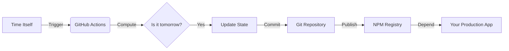

# Today


**The industry-standard chronological state management solution for distributed enterprise applications.**

---

## Overview

In the fast-paced world of modern software development, determining "what day is it" is a non-trivial problem often plagued by timezone inconsistencies, clock skew, and non-deterministic runtime evaluations. 

 **Today** solves this by providing a single, immutable source of truth for the current date. It leverages a sophisticated **Cron-Based Continuous Temporal Integration (CB-CTI)** pipeline to ensure that your application's concept of "today" is synchronized globally, regardless of server location or client configuration.

## Key Features

- **🚀 Zero-Latency Temporal Resolution**: By pre-computing the date during the build phase, `today` eliminates the runtime overhead associated with the instantiation of `Date` objects.
- **🛡️ Deterministic State**: The date is hard-coded into the package distribution. This guarantees that every instance of your application running a specific version of `today` agrees on exactly what day it is.
- **🔒 Immutable Audit Trail**: Every date change is cryptographically signed and stored in the version control history, providing full audibility for compliance-heavy industries (FinTech, HealthTech).
- **📦 SemVer-Compatible Chronology**: We utilize a proprietary versioning strategy (`YYYY.M.D`) that aligns software lifecycle management directly with the Gregorian calendar.
- **☁️ Cloud Agnostic**: Runs everywhere. AWS Lambda, Azure Functions, Google Cloud Run, or your on-premise Kubernetes cluster. `today` is ubiquitous.

## Installation

Integrate `today` into your enterprise ecosystem via NPM:

```bash
npm install @kayooliveira/today-js
```

*Note: Due to high demand/namespace collision, ensure you are installing the correct package or alias it in your private registry.*

## Usage

### Basic Implementation

```javascript
import today from '@kayooliveira/today-js';

// Synchronous, non-blocking retrieval of the temporal state
const currentDate = today();

console.log(`System Status: Operational. Current Temporal Coordinate: ${currentDate}`);
```

### Enterprise Pattern (Dependency Injection)

```javascript
class TimeService {
  constructor(dateProvider) {
    this.dateProvider = dateProvider;
  }

  getAuditLogTimestamp() {
    // Guaranteed consistency across microservices
    return this.dateProvider();
  }
}

const service = new TimeService(require('today'));
```

## Architecture

The `today` ecosystem is built on a robust **Event-Driven Architecture**:

1.  **Temporal Trigger**: A UTC-aligned chronometer fires a signal at `00:00:00Z`.
2.  **State Rehydration**: The **Automated Maintainer Bot** wakes up, calculates the new temporal vector, and injects it into the `data.json` persistence layer.
3.  **Atomic Release**: A new patch version is synthesized, tagged, and published to the global registry immediately.



## Security & Compliance

- **No Runtime Dependencies**: Reduces attack surface area to near zero.
- **Static Analysis Friendly**: Since the date is a string literal, it can be easily parsed by security auditing tools.

## Contributing

We welcome contributions from the community. Please ensure all Pull Requests are aligned with linear time progression. Backwards time travel PRs will be rejected.

## License

ISC © 2025 - Present.
